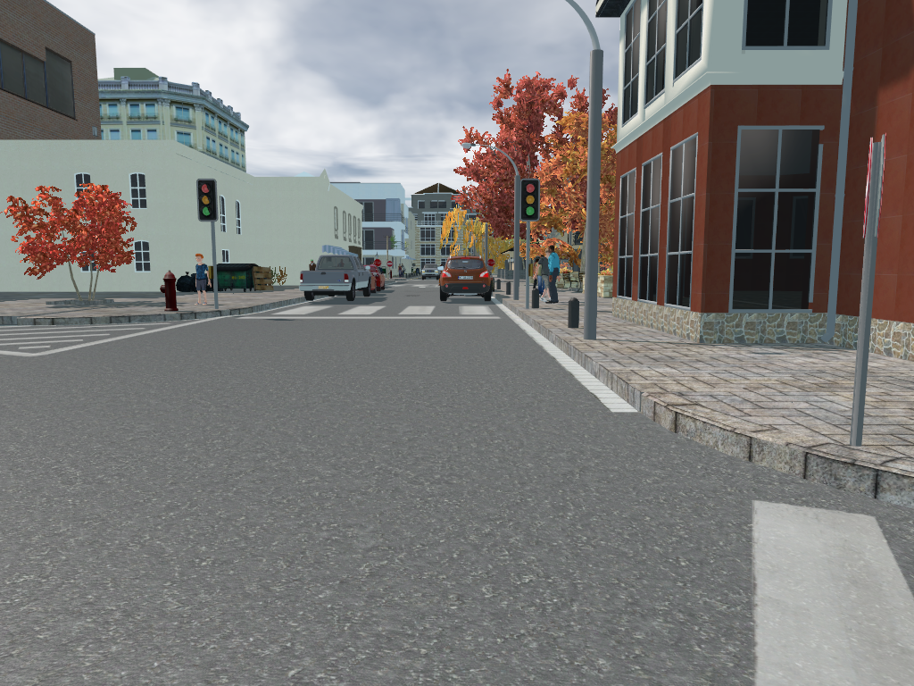
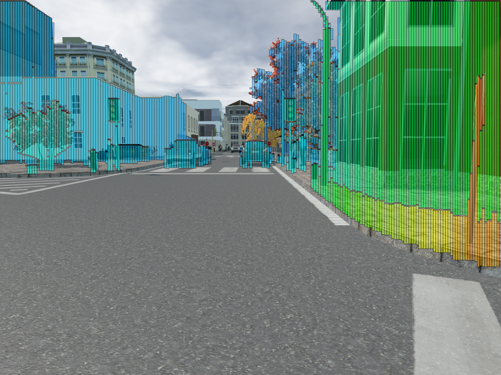

# Stixel World (Stixel-World-Python)
***Stixel-World-Python*** is a python implementation for GPU-accelerated real-time stixel computation [1, 2].

## Stixel computation result
left image, stixel image




## Differences from official implementation
For convenience of parameter tuning, trial and error, the author implemented the method using CUDA and CuPy.
Using of NVRTC runtime compiler has some advantages over AOT compilation, e.g., CMake is not required, easy debugging, visualization and so forth.
The implementation has the following differences from official implementation [2].
* prefix-sum and histogram operation are replaced an implementation using [CUB](https://nvlabs.github.io/cub/)

## Requirements
***VFS-Python*** requires the following libraries:
+ cupy
+ opencv

## Usage
```sh
python main_stixel_world.py
```

## References
1. Hernandez-Juarez, D., Espinosa, A., Moure, J. C., Vázquez, D., & López, A. M. (2017, March). GPU-accelerated real-time stixel computation. In 2017 IEEE Winter Conference on Applications of Computer Vision (WACV) (pp. 1054-1062). IEEE.
1. [https://github.com/dhernandez0/stixels](https://github.com/dhernandez0/stixels)
